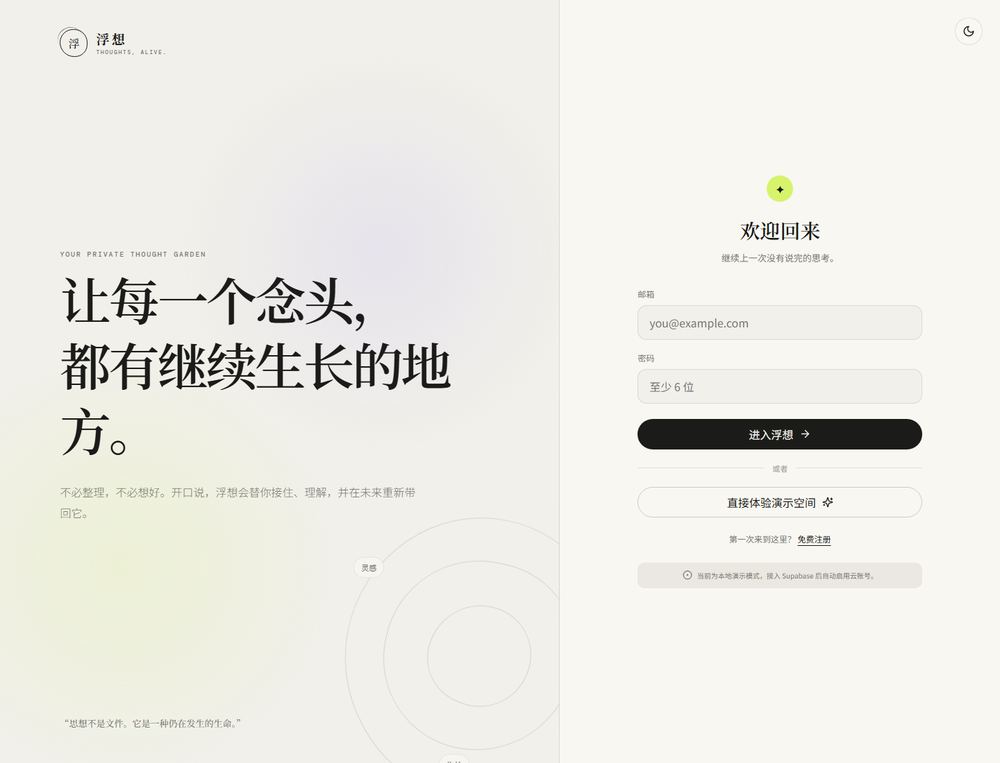

# 浮想 FUXIANG · v1.0.3

一个移动优先、以语音为第一入口的 AI 思想孵化器：先自然表达，再由 AI 完成标题、摘要、类型、标签、空间和下一步整理。



这是一个可公开阅读的产品代码版本。个人记忆库、录音、策略文档和部署凭据均不在本仓库中。

在线体验：[浮想本地演示](https://daizhetang-create.github.io/fuxiang-app-public/)。点击“直接体验演示空间”；此公开版使用规则整理，不调用大模型、不上传录音，也不提供云账号同步。输入的内容仅保存在当前浏览器，请勿输入敏感资料。

## 完整版本能力

以下能力已在产品代码中实现；公开 Pages 演示默认关闭云端与模型调用，方便安全地浏览交互。

- 高完成度响应式 UI、日间/深夜模式、PWA 安装清单。
- 注册登录与本地演示空间。
- 语音录制、服务端转录、文字口述整理和结构化卡片。
- 想法库、搜索、分类筛选、今日浮现、动态主题和内容关联。
- localStorage 演示模式与 Supabase 云同步双模式。
- 硅基流动 OpenAI-compatible 服务端代理；API 密钥不会进入浏览器或版本库。

详见 [APP_STATUS.md](APP_STATUS.md)、[DESIGN_REFERENCES.md](DESIGN_REFERENCES.md) 和 [CHANGELOG.md](CHANGELOG.md)。

## 公开演示能力

公开 Pages 与无密钥本地模式提供：响应式界面、文字整理规则、本地保存、搜索、分类、关联和删除。录音上传、真实模型调用、账号注册与跨设备同步需要自行配置服务端。

## 本地体验

双击 `启动本地演示.bat`，或运行：

```powershell
npm.cmd install
npm.cmd run dev
```

打开 `http://127.0.0.1:4173`，选择“直接体验演示空间”。无任何密钥时，可以体验界面、文字整理、本地保存、搜索、关联和删除；语音转录与跨设备账号需要下面的云端配置。

## 15 分钟启用真实 AI 与账号

### 1. 硅基流动

在部署平台的服务端环境变量中填写：

```env
AI_BASE_URL=https://api.siliconflow.cn/v1
AI_API_KEY=你的新密钥
AI_TEXT_MODEL=Pro/moonshotai/Kimi-K2.6
AI_TRANSCRIBE_MODEL=FunAudioLLM/SenseVoiceSmall
```

部署时只在服务端环境变量中配置项目密钥；用户不需要分别注册模型账号。模型由环境变量选择，无需在硅基流动控制台每次手动切换。

### 2. Supabase 免费项目

1. 创建项目。
2. 在 SQL Editor 先运行 `supabase/00_extensions.sql`，再运行 `supabase/schema.sql`。
3. 复制 Project URL 与 anon public key，填写：

```env
VITE_SUPABASE_URL=你的_Project_URL
VITE_SUPABASE_ANON_KEY=你的_anon_public_key
```

### 3. Vercel 部署

1. 将当前目录放进 GitHub 仓库并由 Vercel Import。
2. 在 Vercel → Settings → Environment Variables 填写上面 6 个变量。
3. Deploy。手机用 HTTPS 地址打开后即可申请麦克风权限。

## 安全

- 不要把真实密钥粘进源码、聊天、GitHub 或 `VITE_` 开头的变量。
- 真实密钥只放 Vercel 的 `AI_API_KEY`；`.env.local` 仅限本机临时调试，且不进入版本快照。
- Supabase schema 已开启 Row Level Security，每个账号只能读取自己的数据。

## Public-source boundary

本仓库只包含可复现的产品代码和演示素材，不包含个人记忆库、聊天/录音原始备份、申请材料、投资策略或线上环境变量。默认演示模式无需任何密钥即可运行。

## 检查

```powershell
npm.cmd run check
```

该命令会检查必要文件、版本号、源码密钥泄露，并执行 TypeScript 与生产构建。
